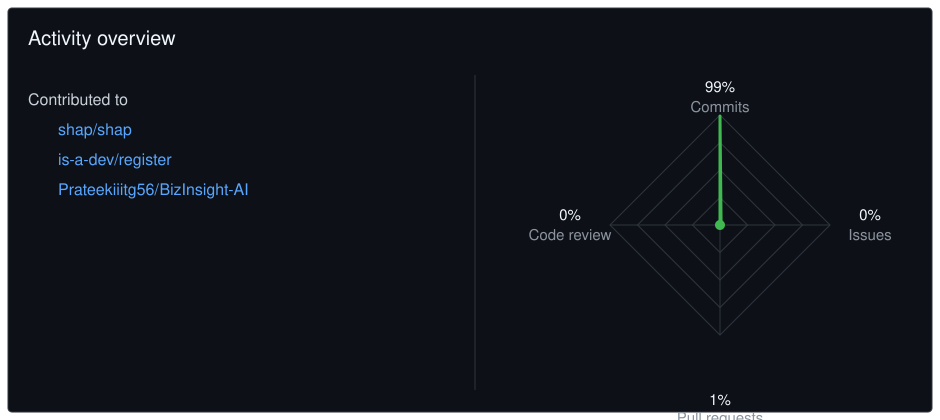

 

---

# 🚀 About Me

- 🎓 Final Year B.Tech CSE (Data Science), MDU Rohtak — 2023–2027 · CGPA 8.23/10
- 💼 Machine Learning Engineer Intern @ **FlyRank AI** (Jul 2026–Present) — Search Intelligence ML for SEO & content optimization
- 🤖 AIML Intern @ **Zeex AI**, Nirmaan IIT Madras (Aug 2026–Present) — Computer Vision dataset engineering & annotation
- 🌍 Campus Ambassador — GSSoC 2026, MyGov (Govt. of India), HackerRank Campus Crew, Zuno by foundit
- 📊 Building production-ready AI, Data Analytics & Full-Stack applications
- 🌱 Currently learning LLMs, Advanced SQL & System Design
- 🤝 Open to Software Engineering, Data Analyst & ML Engineer roles

---

# 🛠 Tech Stack

**Languages:** Python · SQL · R · HTML/CSS/JS
**Data & ML:** NumPy · Pandas · Scikit-learn · Matplotlib · Seaborn
**Frameworks:** FastAPI · Flask · Django · Streamlit · React
**Databases & BI:** PostgreSQL · MySQL · SQLite · Power BI · Tableau · Excel
**Tools:** Git/GitHub · Docker · MLflow · GitHub Actions · Roboflow · YOLO · OpenCV

---

# 💼 Featured Projects

| Project | Description | Links |
|---|---|---|
| **Retail Sales Forecasting Platform** | React + FastAPI + ML time-series forecasting app with auth | [Repo](https://github.com/SAJLENDRAPANDEY/Retail-Sales-Forecasting-Platform) · [Live](https://retails-sales-forecasting-platform.netlify.app/) |
| **NexOrder** | Full-stack order management platform — FastAPI + Razorpay, role-split user/admin dashboards | *repo link needed* |
| **Waste Not — AI Waste Recycling Platform** | Django/SQLite app for smart waste management | [Repo](https://github.com/SAJLENDRAPANDEY/no-waste) · [Live](https://no-waste-lbks.onrender.com/) |
| **House Price Predictor** | Flask ML app deployed on Hugging Face Spaces | [Repo](https://github.com/SAJLENDRAPANDEY/house-price-prediction-app) · [Live](https://huggingface.co/spaces/sajlendrapandey/house-price-predictor-app) |
| **Credit Card Fraud Detection** | ML + SMOTE fraud detection with Streamlit UI | [Repo](https://github.com/SAJLENDRAPANDEY/credit_card_fraud_detection_yash) · [Live](https://huggingface.co/spaces/sajlendrapandey/credit_card_fraud_detection) |
| **Superstore Sales Analysis** | Excel + Python + SQL + Power BI on $2.26M sales dataset | [Repo](https://github.com/SAJLENDRAPANDEY/Superstore-Sales-Analysis) |
| **Supplement Sales Analytics** | Advanced analytics using PostgreSQL | [Repo](https://github.com/SAJLENDRAPANDEY/Supplement-Sales-Analytics-using-PostgreSQL) |
| **Retail Sales Analytics Pipeline** | Modular 7-stage Python ETL pipeline | [Repo](https://github.com/SAJLENDRAPANDEY/retail-sales-analytics) |

---

# 🔥 GitHub Activity Overview

  

---

# 📊 GitHub Analytics

---

# 📈 GitHub Activity

---

# 💻 Coding Profiles

---

# 🎓 Certifications

- 🥇 HackerRank Software Engineer Certificate
- 📊 Deloitte Data Analytics Job Simulation (Forage)
- 🎓 Samsung Innovation Campus — Coding & Programming
- 🤖 Kreativan Technologies — Prompt Engineering (30 Hrs)
- 🧮 Victory Tech Solutions — Data Structures & Algorithms with Python
- 📈 OneRoadmap — Data Analyst & Data Analyst (Big 4 Ready)
- 🧩 KultureHire — Problem Solving with AI and Documentation
- 🌍 GirlScript Summer of Code — Open Source Contributor ('24, '26)

---

# 🤝 Let's Connect

---

⭐ **If you like my work, consider starring my repositories!**

